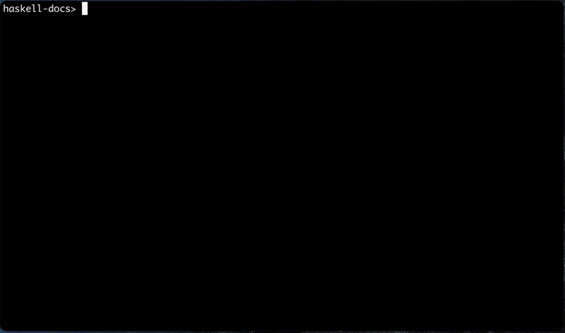

# haskell-docs-cli

This package allows you to perform [Hoogle](https://hoogle.haskell.org/) searches and to
navigate [Hackage](https://hackage.haskell.org/) documentation from the command
line.

Staying in the command line avoids switching to and from the browser, makes it
easier to seach a documentation page, jumping through its content, and to view
the source code of libraries.

## Installation

Download the project and run `stack install`.

It will make the `hdc` executable available in your path.

```
git clone https://github.com/lazamar/haskell-docs-cli.git
cd haskell-docs-cli
stack install
```

## Functionalities

### Search using Hoogle

Just like in Hoogle, just type a function name or
signature to search for matching entries in all of Hackage.

You can select an option by typing its number or by searching for its name with
`/`.

Press `Enter` to view the contents of the current context (search, module or
package) again. If in a search context, pressing `Enter` you will see the
results again. The current context is displayed in the line above the prompt.



### View documentation

Use `:mdocumentation` (or `md` for short) to view documentation about a module.
It will show you the documentation for the first module to match a Hoogle search
for the term you type. As this is a Hoogle search, you can use `+<package name>`
to specify the package if you want, like in Hoogle itself.

Use `:pdocumentation` (or `pd` for short) to view documentation about a package.


### View interfaces

Use `:minterface` (or `:mi`) to view all functions, types, aliases and classes
exported by a module.

Use `pinterface` (or `:pi`) to view the modules contained in a package.

You can navigate further into the options by selecting them by number, or by
name with `/`.


### Navigate the source code

You can view the source code of a search result with `:src <selector>` where
the selector is either the result number or a filter term prefixed by `/`.

If you type `:src` and a search term, `haskell-doc-cli` will load the source of
the first Hoogle result that is not a module or package.


## Contributing

Contributions are very welcome. Here are some things that would be nice to have:

- Fix more edge cases
- Windows compatibility
